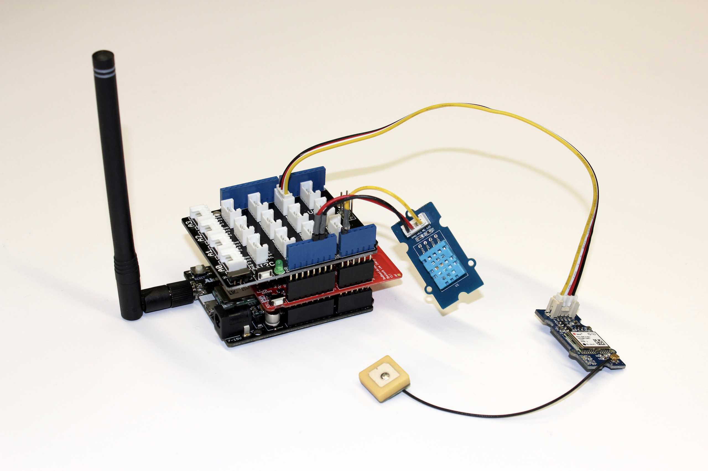

# Internet of Bicycles (#Devices)

This project is part of the course *Internet of Bicycles - IoT & Ultra Narrow Band Communication Infrastructures*, which took place at the [Institute for Geoinformatics, Münster](https://www.uni-muenster.de/Geoinformatics/en/index.html) in summer term 2015.

The Internet is a network of networks, which connects large amounts of devices. Many of these devices are primarily made to store, retrieve, analyze and visualize data, as needed to collect and share information. But today more and more devices are being connected, which are everyday commodities, serving purpose such as driving from A to B, boiling water or detecting fire. By connecting those things through the Internet of Things (IoT) the existing information infrastructure transforms to a cyber physical infrastructure fusing real world physical systems with virtual systems. Since things are always somewhere, demanding for or providing space-time related information, the IoT comes up with many challenges in the field of Geoinformatics.
The course collaborated with some IoT stakeholders: Ultra narrow band communication infrastructures such as the [SIGFOX](http://www.sigfox.com/en/) infrastructure supported the connection of devices at low costs and low energy consumption. The [DFMG](http://www.dfmg.de/) operated a radio tower, which was needed to support a wireless M2M communication. The [Deutsche Telekom](http://m2m.telekom.com/discover-m2m/about) is developing IoT platforms to support IoT applications. The [Trelock](http://www.trelock.de/web/en/index.php) company is interested in the potential of IoT concepts as a basis for new products for bicycles. Within the course we collaborated with these institutions and we explored and applied IoT concepts and technologies for integrating bicycles into the Internet of Things.
Learning objectives are: deeper understanding of IoT principles, standards, technologies, applications; improving SW development skills in the field of project management, software design, web technologies, technologies for collecting, managing, analyzing geospatial data.

***

### Goal

We built a anti-theft device-prototype for bicycles. We were utilizing the SIGFOX radio network to transmit the current lock status of the bike, its position and auxiliary environment data (such as temperature).

When the bike is in use, the device should transmit collected data directly with a smartphone over Bluetooth. This is due to limitations with the SIGFOX radio network in regards to number and size of messages, as well as reduced reliability when moving/driving with the transmitter.

### Related repositories

* Server-Platform: [https://github.com/mrunde/IoBikes-Platform](https://github.com/mrunde/IoBikes-Platform)
* Android-App: [https://github.com/aohrem/IoBApp](https://github.com/aohrem/IoBApp)

### Contributors

#####  [Tobias Brüggentisch](https://github.com/TobiTobsen92)
#####  [Christoph Kisfeld](https://github.com/chk1)
#####  [Lukas Lohoff](https://github.com/LukasLohoff)
#####  [Nicholas Schiestel](https://github.com/nicho90)
#####  [René Unrau](https://github.com/ReneU)

### Hardware

* [Snootlab Akeru beta 3.3](http://snootlab.com/lang-en/snootlab-shields/829-akeru-beta-33-en.html) (Arduino UNO based device with TD1208 SIGFOX modem)
* [RedBearLab.com Bluetooth Low Energy Shield v2.1](http://redbearlab.com/bleshield/)
* [Seeed Studio Grove Base Shield 2.0](http://www.seeedstudio.com/wiki/Grove_-_Base_shield_v2)
* [Seeed Studio Grove GPS 1.1](http://www.seeedstudio.com/wiki/Grove_-_GPS)
* [Seeed Studio Grove DHT11 v1.1 Temperature & Humidity Sensor](http://www.seeedstudio.com/wiki/Grove_-_Temperature_and_Humidity_Sensor)

### Notes about the GPS receiver

Our Seeed Studio Grove GPS shield is the older version that comes with an u-blox 6 chip. Useful resources for usage and configuration can be found here:

* [u-center software](https://www.u-blox.com/de/evaluation-tools-a-software/u-center/u-center.html) (when chip is directly connected to a PC via USB to Serial adapter)
* [u-blox 6 hardware manual](http://www.u-blox.com/images/downloads/Product_Docs/u-blox6_ReceiverDescriptionProtocolSpec_(GPS.G6-SW-10018).pdf)
* UKHAS Wiki pages about configuring the u-blox 6 at runtime with Arduino: [1](https://ukhas.org.uk/guides:ublox6), [2](https://ukhas.org.uk/guides:ublox_psm)

### Software (required libraries)

* [Akeru library](http://snoot.it/akerulib)
* [TinyGPS library](https://github.com/mikalhart/TinyGPS/releases)
* [NordicSemiconductor BLE SDK library](https://github.com/NordicSemiconductor/ble-sdk-arduino)
* [Seeed Studio DHT library](https://github.com/Seeed-Studio/Grove_Temperature_And_Humidity_Sensor)

Copy the extracted libraries into a folder in your `~\Documents\Arduino\libraries`, make sure your folder names don't have any `-` or other non alphanumeric characters in them or else the Arduino IDE will complain.

Finally install the `theftprotection_BLE\theftprotection_BLE.ino` on your device.

***

### The MIT License (MIT)

**Copyright (c) 2015 Tobias Brüggentisch, Christoph Kisfeld, Lukas Lohoff, Nicholas Schiestel and René Unrau**

Permission is hereby granted, free of charge, to any person obtaining a copy
of this software and associated documentation files (the "Software"), to deal
in the Software without restriction, including without limitation the rights
to use, copy, modify, merge, publish, distribute, sublicense, and/or sell
copies of the Software, and to permit persons to whom the Software is
furnished to do so, subject to the following conditions:

The above copyright notice and this permission notice shall be included in all
copies or substantial portions of the Software.

THE SOFTWARE IS PROVIDED "AS IS", WITHOUT WARRANTY OF ANY KIND, EXPRESS OR
IMPLIED, INCLUDING BUT NOT LIMITED TO THE WARRANTIES OF MERCHANTABILITY,
FITNESS FOR A PARTICULAR PURPOSE AND NONINFRINGEMENT. IN NO EVENT SHALL THE
AUTHORS OR COPYRIGHT HOLDERS BE LIABLE FOR ANY CLAIM, DAMAGES OR OTHER
LIABILITY, WHETHER IN AN ACTION OF CONTRACT, TORT OR OTHERWISE, ARISING FROM,
OUT OF OR IN CONNECTION WITH THE SOFTWARE OR THE USE OR OTHER DEALINGS IN THE
SOFTWARE.
